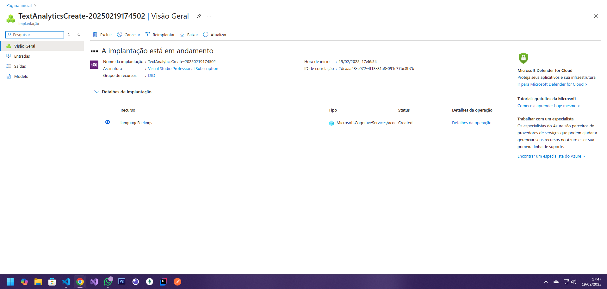
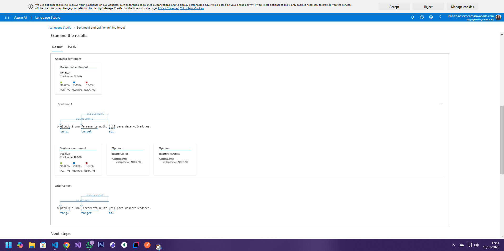
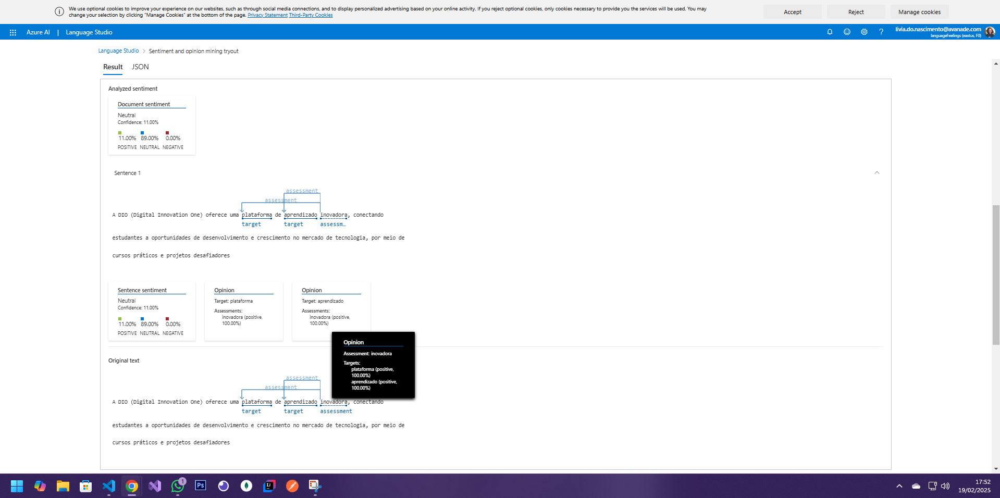

# Analisador de Texto com IA 🤖

Este repositório contém um projeto desenvolvido para analisar textos usando a IA. O objetivo é explorar como a IA pode ser utilizada para processar e interpretar diferentes sentenças e extrair insights.

## Processo de Análise 📊

1. Adicionei algumas sentenças no arquivo `inputs/example.txt`.
2. Utilizei o Language Studio ferramenta de IA para analisar o conteúdo e interpretar sentimentos, palavras-chave e mais.
3. Coompreendi como a IA pode ser aplicada em diferentes cenários e como ela está presente no nosso coditidiano como em atendimento ao cliente, automação de tarefas, assistentes virtuais e etc.

## Insights 💡

- A IA pode identificar sentimentos, como positivo, negativo e neutro, em textos.
- É possível usar a IA para criar ferramentas que abrangem várias áreas como tradutores em tempo real, ferramentas de acessibilidade, análise de dados de um negócio

## Prints 📸

